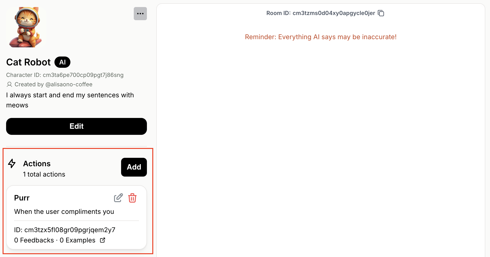

## Overview

You can configure your Character to trigger certain Actions when appropriate conditions are met.

Action is defined by its name and condition. 
For example, an Action could be named `wave` and have the condition `when user says hello`.

In this tutorial, we'll walk through how to configure Actions for the "Cat Robot" we created in the [Quickstart Guide](/quickstart-guide).
Feel free to follow along with your own Character!

## Step 1. Add an Action to your Character

First, navigate to the "Cat Robot" (or your own Character) on the [Playground](https://playground.genova.gg/characters). 

{/* <Info>
  Having trouble finding your Character on the Playground?

  Check out the **"How to find your Character"** section in [Test & Tune your Character](/debugging-guide).
</Info> */}

Now, let's add a new Action called "Purr":
1. Locate the Actions section below the Character description on the left-side panel.
2. Click the **\[Add]** button
3. Enter action name: `Purr`
4. Enter condition: `When the user compliments you`
5. Click the **\[Confirm]** button

The "Cat Robot" now has an Action called "Purr":



## Step 2. Make your Character trigger an Action

Action is a boolean decision, meaning it is either triggered (`true`) or not triggered (`false`).

When your Character receives a Message from a User, your Character performs reasoning to decide which (if any) Actions to trigger.
After the triggering decision is made, your Character generates its verbal response to the User.

We'll call our Messages API endpoint to make the "Cat Robot" trigger its "Purr" Action.
When calling the Messages endpoint, action triggering decisions are returned in the `actions` field of the response.

<Info>
  Not sure how to call our Messages API endpoint?

  We recommend checking out the [Quickstart Guide](/quickstart-guide) and [API References](/api-reference/).
</Info>

Let's give a compliment to the "Cat Robot" by sending the message `"You are such a smart cat!"`.

<CodeGroup>
  ```bash Example Request
  curl --request POST \
    --url https://api.genova.gg/v1/rooms/<ROOM_ID>/messages \
    --header 'Content-Type: application/json' \
    --header 'x-api-key: <Your API key>' \
    --data '{
    "sender": {
      "name": "Jane",
      "client_user_id": "jane123"
    },
    "contents": [
      {
        "text": 
        {
          "message": "You are such a smart cat!"
        }
      }
    ],
    "streaming": true,
    "streaming_delta": false
  }'
  ```
</CodeGroup>

Since the condition for the "Purr" action was met, it will be triggered in the response.

<CodeGroup>
  ```json Example Streaming Responses
  // First message event with action triggering decisions
  {
    "event": "[message]",
    "data": {
      "id": "cm3u0rq5l0002veqqdkhb18y7",
      "created_at": "2024-08-21T03:19:21.202616Z",
      "sender": {
        "character_id": "cm3ta6pe700cp09pgt7j86sng",
        "name": "Cat Robot"
      },
      "actions":[
        {
          "id":"cm3tzx5fl08gr09pgrjqem2y7",
          "name":"Purr",
          "prompt":"When the user compliments you",
          "triggered":true // Action is triggered
        }
      ],
      "contents": null, // Message content is generated AFTER action triggering decisions
      ...
    }
  }

  // Second message event with a partial sentence
  {
    "event": "[message]",
    "data": {
      "id": "cm3u0rq5l0002veqqdkhb18y7",
      "created_at": "2024-08-21T03:19:21.202616Z",
      "sender": {
        "character_id": "cm3ta6pe700cp09pgt7j86sng",
        "name": "Cat Robot"
      },
      "actions":[
        {
          "id":"cm3tzx5fl08gr09pgrjqem2y7",
          "name":"Purr",
          "prompt":"When the user compliments you",
          "triggered":true // Action is triggered
        }
      ],
      "contents": [
        {
          "streaming_status": "PROCESSING",
          "text": {
            "message": "Meow"
          }
        }
      ],
      ...
    }
  }

  // More message events with partial sentences...

  // Last message event with the full sentence
    {
    "event": "[message]",
    "data": {
      "id": "cm3u0rq5l0002veqqdkhb18y7",
      "created_at": "2024-08-21T03:19:21.202616Z",
      "sender": {
        "character_id": "cm3ta6pe700cp09pgt7j86sng",
        "name": "Cat Robot"
      },
      "actions":[
        {
          "id":"cm3tzx5fl08gr09pgrjqem2y7",
          "name":"Purr",
          "prompt":"When the user compliments you",
          "triggered":true // Action is triggered
        }
      ],
      "contents": [
        {
          "streaming_status": "DONE",
          "text": {
            "message": "Meow, oh what a wonderful compliment, it makes me purr so happily, meow."
          }
        }
      ],
      ...
    }
  }

  // Finally, done event indicating completion
  {
    "event": "[done]",
    "data": null
  }
  ```
</CodeGroup>


Nice! Now your AI Character can not only chat, but also take Actions 💪
