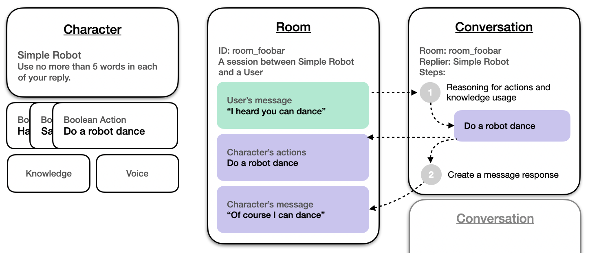

## Overview

Our Character API allows you to build AI NPCs, Assistants, Friends within your own Games or Apps. A Character can be defined by its own system prompts as well as a set of other core functions you might want it to leverage: voice, actions, knowledge and more.

You can explore the capabilities of our Characters using our AI Playground tool or by building one with the 4-step Devs Quickstart Guide.

## How Characters Work
An simplified diagram of how components work together behind the Character APIs

### Important Terms:

**Character:**	Purpose-built AI, powered by our models and systems, customized & tuned by developers.

**Room:**	A conversation session between Character(s) and User(s). *Rooms* store *Messages* and automatically handle truncation to fit content into a model’s context.

**Message:**	A message created by a Character or a User. Messages stored as a list in the Room.

**User:** Primarily just a String-typed ID that represents a distinct user  
