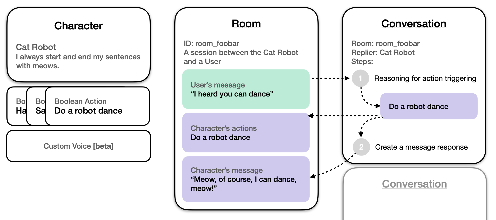

## Overview

Our Character API allows you to build AI NPCs, assistants, or teammates that you can easily integrate with your games and apps. A Character is defined by its own system prompt as well as other core functions you could leverage: Actions and Voices (beta).

You can explore the functionalities of our Characters using the [Genova Labs Playground](https://playground.genova.gg/). If you're looking for a quick setup, check out our [4-step Quickstart Guide](/quickstart-guide) to get started!

## How Characters Work

Here's a simplified diagram of how components work together behind the Character APIs

### Important Terms

**Character:**	Purpose-built AI, powered by our models and systems, customized & tuned by you.

**User:** Non-AI participant in the conversation, primarily represented by a string ID that maps to a distinct *User*.

**Room:**	A conversation session between *Character(s)* and *User(s)*. A *Room* stores *Messages* and automatically utilize truncation to keep content within into a model’s context length.

**Message:**	A message from a *User* or a *Character* in a conversation. *Messages* are stored as a list in the *Room*.
