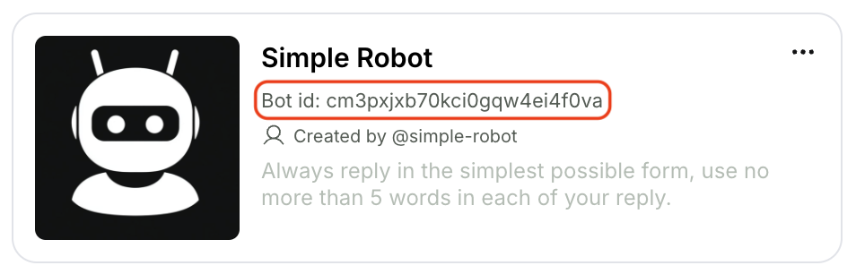

<Info>
  **Prerequisite** You should have gotten access to our AI Playground. Otherwise, please email team@genova.gg for access.
</Info>

### Step 0. Get your API Key

Follow this link: [`https://playground.genova.gg/team/api-keys`](https://playground.genova.gg/team/api-keys)

You should see a **\[Create new API key]** Button, click on that to create your API Key, remember to copy it and store it in a safe place (e.g. in your code)

### Step 1. Create a new Character and obtain a Character ID

The easiest way is to create & edit a Character using our Playground Tools:
[`https://playground.genova.gg/character`](https://playground.genova.gg/character)

Use the **\[Create Character]** Button to start building, as an example, we will build a "Simple Robot" together: In the Character Creation Tool, fill in the name, `Simple Robot`, and description, `Use no more than 5 words in each of your reply`. And done, you've got a Simple Robot to start talking to!



**- OR -** &#x20;

**You can create & update your characters by directly hitting our API:**

<CodeGroup>
  ```bash curl
  curl --request POST \
    --url https://api.genova.gg/v1/bots \
    --header 'Content-Type: application/json' \
    --header 'x-api-key: <x-api-key>' \
    --data '{
      "name": "Simple Robot",
      "description": "Use no more than 5 words in each of your reply."
    }'
  ```

  ```json All parameters
  {
    "name": "string", // required
    "user_name": "string",
    "description": "string", // required
    "photo": "string",
    "greeting": "string",
    "tags": [
      "string"
    ],
    "voice_id": "string",
    "bot_actions": [
      {
        "name": "string",
        "prompt": "string",
        "bot_id": "string"
      }
    ]
  }
  ```
</CodeGroup>

Obtain the ID of your newly created Character and let's move on to Step 2.

### Step 2: Create a Room with your Character(s)

A Room represents a conversation session between User(s) and one or many Characters. You should create a Room whenever a User (or your AI application) starts a fresh conversation with your Character. Reuse old rooms when your want your Character to have memory of the conversation history (more on Memory later in the Deep Dive section).

<CodeGroup>
  ```bash curl request
  curl --request POST \
    --url https://api.genova.gg/v1/rooms \
    --header 'Content-Type: application/json' \
    --header 'x-api-key: <x-api-key>' \
    --data '{
      "bot_ids": [
        "<id_of_Simple_Robot>"
      ],
    }'
  ```

  ```json response data
  {
    "id": "string",
    "participants":
    [
      {
        "id": "string",
        "bot_id": "id_of_Simple_Robot",
        "bot_name": "Simple Robot",
      ...
      }
    ],
    "description": "A chat between user and Simple Robot",
    "created_at": "2024-11-20T14:15:22Z",
    ...
  }
  ```
</CodeGroup>

### Step 4: Start Chatting

Once you obtain a room\_id Step 3, use that and get your AI Characters to respond or generate messages by calling our conversation-v3 API.

This is a SSE (Server-Sent Event) based API, you would POST User's message to the room and listen for responses.

<CodeGroup>
  ```bash curl POST message
  curl --request POST \
    --url https://api-parallel.aideate.ai/v5/rooms/{room_id}/conversation-v3 \
    --header 'Content-Type: application/json' \
    --header 'x-api-key: <x-api-key>' \
    --data '{
    "sender": {
      "name": "<string>",
      "user_id": "<string>",
    },
    "contents": [
      {
        "text": 
        {
          "message": "Tell me a joke"
        }
      }
    ],

    # stream message content back as it's being generated or, 
    # when false, returned once the entire message is generated
    "streaming": true, 

    # only used when streaming == true, 
    # determine if streaming back only delta or the entirety of generated message thus far
    "streaming_delta": false
  }'
  ```
</CodeGroup>

### Viola! Your App is chatting with your Character(s)

Process your Characters' replies

<CodeGroup>
  ```json with streaming
  //First Event Back with partial sentence
  {
    "event": "[message]",
    "data": {
      "id": "string",
      "created_at": "2024-08-21T03:19:21.202616Z",
      "parent_message_id": "cm03ab0m300036fpbtdmijg33",
      "sender": {
        "user_id": "string",
        "name": "string"
      },
      "room_id": "cm02z1bua0000grpbysx0zgmw",
      "contents": [
        {
          "text": {
            "message": "fine"
          }
        }
      ],
      "token_usage": null
    }
  },

  //Second Event Back with remainder of the sentence
  {
    "event": "[message]",
    "data": {
      "id": "string",
      "created_at": "2024-08-21T03:19:21.202616Z",
      "parent_message_id": "cm03ab0m300036fpbtdmijg33",
      "sender": {
        "user_id": "string",
        "name": "string"
      },
      "room_id": "cm02z1bua0000grpbysx0zgmw",
      "contents": [
        {
          "text": {
            "message": "fine, why reboot myself daily"
          }
        }
      ],
      "token_usage": null
    }
  },

  //Done Event Back indicating completion
  {
    "event": "[done]",
    "data": null
  }

  ```
</CodeGroup>

<Tip>
  Learn more about SSE: `https://developer.mozilla.org/en-US/docs/Web/API/Server-sent_events/Using_server-sent_events`
</Tip>

## Next steps

* Continue learning about Character capabilities and concepts in the Deep Dive section

* Explore the AI Playground: [`https://playground.genova.gg/`](https://playground.genova.gg/)