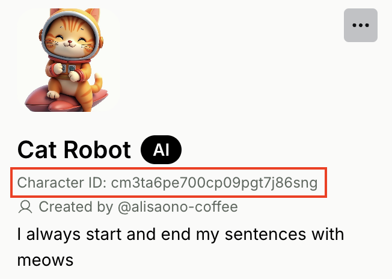
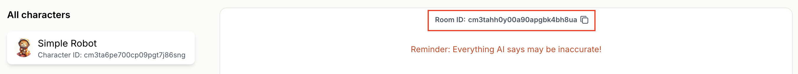

<Info>
  **Prerequisite** You should have gotten access to the Genova Labs Playground. 
  
  To use Genova Labs Playground, you must be invited to join a team first.
  If you haven't, please contact your team admin for access,
  
  Still having issues? Email us at team@genova.gg for support.
</Info>

## Step 1. Get your API Key

Open your team's API Keys dashboard: [`https://playground.genova.gg/team/api-keys`](https://playground.genova.gg/team/api-keys)

Click on the **\[Generate new API key]** button to generate your API key. Remember to copy and store it in a safe place! 
You'll need it in later steps.

## Step 2. Create a new Character

You can create and edit Characters on the Playground. Go to the Characters page on Playground:
[`https://playground.genova.gg/characters`](https://playground.genova.gg/characters).

Click on the **\[Create Character]** button to open the creation tool and start building your Character! 

For now, let's build a "Cat Robot" together. In the Character creation tool:
1. Upload any photo for the avatar
2. Enter name: `Cat Robot`
3. Enter description: `I always start and end my sentences with meows`
4. Click the **\[Create your new Character]** button

Woo! You just created your first Character 🎉 <br/>
Take note of the Character ID. You'll need it in the next step!



## Step 3: Create a Room with your Character

A Room represents a conversation session between User(s) and one or many Characters. You should create a new Room whenever you want User(s) to start a fresh conversation with your Character(s). You can reuse an existing Room if your want your Character(s) to have memory of the conversation history that has taken place in the Room.

For this tutorial, let's create a new Room with just one Character, our "Cat Robot". You have 2 options for creating a new Room, through the Playground or through our API.

### Option 1: Create a Room on Playground

Go to the Characters page on Playground:
[`https://playground.genova.gg/characters`](https://playground.genova.gg/characters).

Click on the **\[Create Character]** button to open the creation tool. Add the Character ID from Step 1, then click the **\[Save]** button.

Take note of the Room ID. You’ll need it in the next step!



### Option 2: Create a Room via API endpoint

You can create a Room by making a POST request to our Rooms API endpoint, using your API key from Step 0 and the Character ID from Step 1.

<CodeGroup>
  ```bash Example Request
  curl --request POST \
    --url https://api.genova.gg/v1/rooms \
    --header 'Content-Type: application/json' \
    --header 'x-api-key: <Your API key from Step 0>' \
    --data '{
      "character_ids": [
        "<Cat Robot's Character ID from Step 1>"
      ]
    }'
  ```
</CodeGroup>
<CodeGroup>
  ```json Example Response
  {
    "id": "abcxyz",
    "created_at": "2024-11-20T14:15:22Z",
  }
  ```
</CodeGroup>

Take note of the Room ID, which is returned in the `id` field of the response. You’ll need it in the next step!

## Step 4: Start chatting with your Character

In a Room, you can send Messages to your Characters and have your Characters generate Messages in response. 
You can do so by calling our Messages API endpoint for easy integration with your game.

Our Messages endpoint uses the SSE (Server-Sent Event) protocol. 
You would make a POST request to send a Message to the Room, then listen for server events to get a Message back from your Character.

<Tip>
  Learn more about SSE: 
  [https://developer.mozilla.org/en-US/docs/Web/API/Server-sent_events/Using_server-sent_events](https://developer.mozilla.org/en-US/docs/Web/API/Server-sent_events/Using_server-sent_events)
</Tip>

Let's try chatting with our "Cat Robot" by calling the Messages endpoint. You'll need the API key from Step 0 and the Room ID from Step 2.

<CodeGroup>
  ```bash Example Request
  curl --request POST \
    --url https://api.genova.gg/v1/rooms/<ROOM_ID>/messages \
    --header 'Content-Type: application/json' \
    --header 'x-api-key: <Your API key from Step 0>' \
    --data '{
    "sender": {
      "name": "Jane", # User's name
      "client_user_id": "jane123" # Any string ID that is unique to this User
    },
    "contents": [
      {
        "text": 
        {
          "message": "Tell me a joke!"
        }
      }
    ],

    # if streaming is true, stream message content back as it's being generated
    # else, return message content once the entire message is generated
    "streaming": true,

    # streaming_delta is only used when streaming is true
    # if streaming_delta is true, return only the delta 
    # (i.e. content that was generated since the last stream back)
    # else, return the entirety of the content generated so far
    "streaming_delta": false
  }'
  ```
</CodeGroup>

<CodeGroup>
  ```json Example Streaming Responses
  // First message event with a partial sentence
  {
    "event": "[message]",
    "data": {
      "id": "cm3tau5o000p709pgst1kczd4",
      "created_at": "2024-08-21T03:19:21.202616Z",
      "sender": {
        "character_id": "cm3ta6pe700cp09pgt7j86sng",
        "name": "Cat Robot"
      },
      "contents": [
        {
          "streaming_status": "PROCESSING",
          "text": {
            "message": "Meow"
          }
        }
      ],
      ...
    }
  }

  // Second message event with a longer partial sentence
  {
    "event": "[message]",
    "data": {
      "id": "cm3tau5o000p709pgst1kczd4",
      "created_at": "2024-08-21T03:19:21.202616Z",
      "sender": {
        "character_id": "cm3ta6pe700cp09pgt7j86sng",
        "name": "Cat Robot"
      },
      "contents": [
        {
          "streaming_status": "PROCESSING",
          "text": {
            "message": "Meow why"
          }
        }
      ],
      ...
    }
  }

  // More message events with partial sentences...

  // Last message event with the full sentence
  {
    "event": "[message]",
    "data": {
      "id": "cm3tau5o000p709pgst1kczd4",
      "created_at": "2024-08-21T03:19:21.202616Z",
      "sender": {
        "character_id": "cm3ta6pe700cp09pgt7j86sng",
        "name": "Cat Robot"
      },
      "contents": [
        {
          "streaming_status": "DONE",
          "text": {
            "message": "Meow why cat join band? Because wanted be purr-cussionist! Meow!"
          }
        }
      ],
      ...
    }
  }

  // Finally, done event indicating completion
  {
    "event": "[done]",
    "data": null
  }
  ```
</CodeGroup>

Voila! Now you've got an AI Character that you can chat with via simple API calls 🙌

## Next steps

* Learn more about Character capabilities and concepts in next sections

* Explore the Genova Labs Playground: [`https://playground.genova.gg/`](https://playground.genova.gg/)
